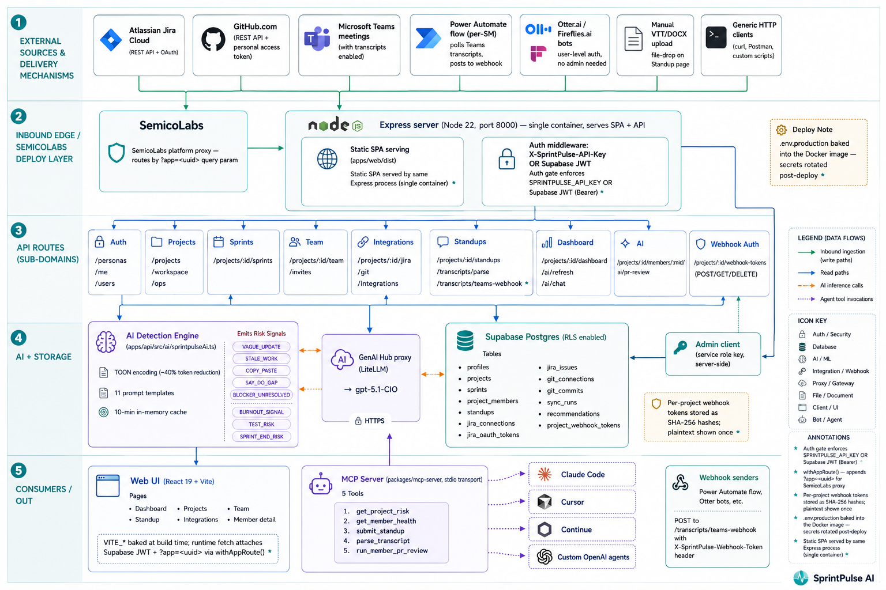
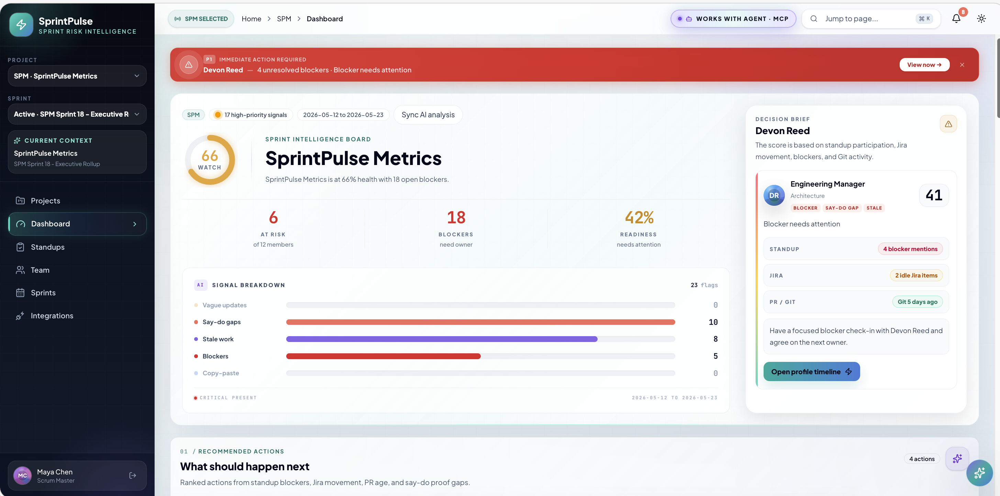
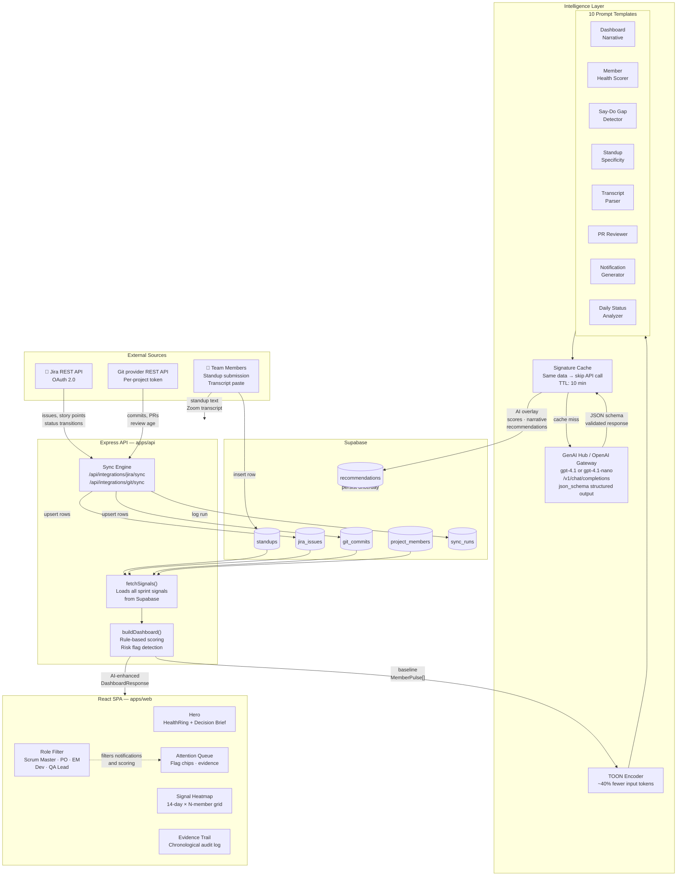
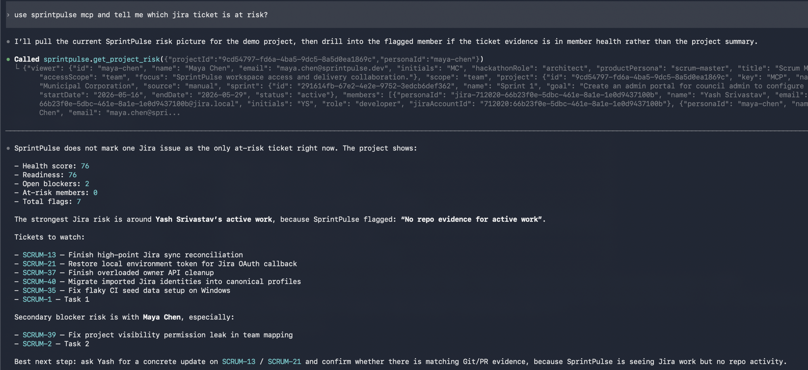

# SprintPulse AI

    

**Sprint risk intelligence that catches the gap between what your team _says_ in standup and what they _actually_ ship.**

### Contents

- [Judge Quick Scan](#judge-quick-scan) · [3Cs at a Glance](#3cs-at-a-glance) · [UI Preview](#ui-preview)
- [Why This Matters](#why-this-matters--business-value) · [What Makes This Different](#what-makes-this-different) · [Competitive Positioning](#competitive-positioning) · [The Idea](#the-idea)
- [The 5 Detection Types](#the-5-detection-types) · [Feature Status](#feature-status) · [Dashboard Tour](#dashboard-tour)
- [Architecture](#architecture) · [System Architecture](#system-architecture) · [AI Pipeline](#ai-pipeline) · [Design Tradeoffs](#design-tradeoffs)
- [Code Quality](#code-quality) · [Roles and Personas](#roles-and-personas)
- [Run Locally](#run-locally) · [Environment Variables](#environment-variables) · [Supabase Migrations](#supabase-migrations) · [Deployment](#deployment)
- [Demo Credentials & Test Scenarios](#demo-credentials--test-scenarios) · [Demo Flow](#demo-flow)
- [Transcript Integration](#transcript-integration) · [MCP Server](#mcp-server--sprintpulse-as-an-agent-tool) · [Sample agent run](#sample-agent-run)
- [Roadmap](#roadmap) · [Team](#team) · [Further Reading](#further-reading)

SprintPulse continuously compares standup updates against Jira ticket movement and Git commit activity to surface delivery risk before sprint-end. An AI detection engine scores every team member, flags specific failure patterns, and translates the evidence into a role-aware decision brief for Scrum Masters, Product Owners, Engineering Managers, QA Leads, and Developers.

---

## Judge Quick Scan

| Signal | What to look for |
|---|---|
| **Product** | AI sprint-risk cockpit that correlates standups, Jira, Git provider activity, PR/MR pressure, and transcript evidence. |
| **Core insight** | Detects the say-do gap before sprint review: what the team says vs what Jira/Git/PR evidence proves. |
| **Demo path** | Log in as Maya Chen, open Dashboard, show the decision brief and attention queue, then run **Sync AI analysis**. |
| **Reliability** | Manual AI refreshes persist dashboard snapshots, so demos load resolved AI output without depending on gateway latency. |
| **Agent wow** | MCP exposes six tools for Claude Code, Cursor, Codex, or any MCP host to read risk, parse standups, run PR review, and create in-app follow-ups. |
| **Validation** | `npm test`, `npm run typecheck`, `npm run benchmark:toon`, `npm run check:role-demo`. |
| **Live demo** | [solution1.demopersistent.com](https://solution1.demopersistent.com/?app=f65ea48f-bc1d-48ff-a3ed-a204ffe48bee) — `maya.chen@sprintpulse.dev` / `12345678`. |

---

## 3Cs at a Glance

| | **Core** — *what the AI does* | **Context** — *how it's grounded* | **Collaboration** — *how it ships* |
|---|---|---|---|
| **Lives in** | `apps/api/src/ai/sprintpulseAi.ts`, `apps/api/src/ai/prompts/` | `apps/api/src/ai/openaiResponses.ts`, `scripts/benchmark-toon.mjs` | `apps/api/src/routes/`, `packages/mcp-server/src/tools.ts` |
| **What it does** | 10 prompt templates, signature-based cache, rule-based fallback | TOON encoding (~47% fewer tokens), three-signal correlation, evidence-linked output, RLS-scoped queries | Dashboard for humans, 6 MCP tools for agents — same backend, same evidence |
| **Proof in repo** | `gpt-4.1` / `gpt-4.1-nano` with `json_schema` structured output | `npm run benchmark:toon` (~46.9% reduction on bundled fixture) | `npm run check:role-demo` confirms cross-role data flow |

*Same intelligence brain. Two surfaces: humans through the dashboard, agents through MCP. Both see the same evidence trail.*

---

## UI Preview

### Architecture Diagram



### Dashboard Screenshot



These screenshots show the deployed system architecture and the primary dashboard experience: role-aware navigation, health rings, signal breakdown, decision brief, AI refresh, and MCP access.

---

## Why This Matters — Business Value

**The problem we sell against.** Engineering teams already have Jira (truth about tickets), Git providers (truth about code), and standups (the team's narrative of work). What no one has is the **delta between those three sources**. That delta is where sprint failure lives. Industry data consistently shows ~70% of software projects miss original timelines (Standish Group CHAOS) and ~25% of sprints fail to deliver on commitment (Scrum.org research). The cost of a missed sprint isn't the delay alone — it's the cascade: rework, scope cuts, missed releases, and the burnout that compounds across quarters.

**Where today's tools stop.** Jira dashboards report activity volume. Git analytics report commit velocity. Manual standup notes are unstructured prose nobody re-reads. None of these surface the *say–do gap*: a developer telling the team they're "continuing on the API task" while Git shows zero commits and Jira shows zero status transitions for three days running. That gap is the canonical early warning of a sprint in trouble, and it gets lost between three siloed tools.

**What SprintPulse delivers, in cost terms:**

| Today (without SprintPulse) | With SprintPulse |
|---|---|
| Sprint failure detected at sprint review — too late to course-correct | Risk flagged in days 2–4 of a 14-day sprint, with named-member specificity |
| Scrum Master spends ~5 hours/sprint correlating standups, Jira boards, and PR queues by hand | Continuous AI correlation; SM sees one ranked attention queue |
| 30+ minute daily standup conversations produce zero structured artifact | Every meeting transcript auto-parses into per-member entries + risk update |
| Engineering manager learns about burnout signals from skip-level 1:1s, not data | `BURNOUT_SIGNAL` flag fires from commit-time + standup-tone divergence |
| Cross-team agents have no machine-readable view of sprint state | MCP server exposes 6 tools so MCP-capable hosts such as Claude Code and Cursor can read SprintPulse like a database |

**Pricing assumptions for the ROI conversation.** A typical 10-person scrum team running 2-week sprints loses ~$80K when a sprint slips a week (10 engineers × 40 hours × $200 loaded cost). Detecting one slip-able sprint per quarter recoups the cost of a year-long SprintPulse subscription priced at standard SaaS per-seat economics. The win isn't a 5% optimization — it's catching the one sprint per quarter that would have failed silently.

**Who pays for this.** Engineering managers, VP-engineering, and CTOs with delivery-predictability problems. The buyer cares about sprint reliability across teams, not about another dashboard. SprintPulse is positioned as **the layer that interprets** existing tools' raw signals, not yet another tool generating new ones.

---

## What Makes This Different

Most sprint analytics products are dashboard wrappers around the same data the source tools already display. Three architectural choices set SprintPulse apart:

1. **TOON-encoded AI prompts** — Tabular sprint data is encoded in TOON (Token-Oriented Output Notation) instead of JSON before being sent to the language model. The encoding reduces token usage by ~40% on the structured payloads our prompts use, which makes per-member-per-sprint AI scoring economically viable. Cheaper inference per evaluation means richer evaluation cadence without burning budget.

2. **Source-agnostic transcript ingestion** — One webhook URL accepts WebVTT (Teams) and plain `Speaker:` text. The same parser powers the standup page file upload and the webhook path, so SprintPulse can ingest transcripts from any source that can provide VTT or speaker-labelled text.

3. **MCP-native — agents call SprintPulse, not just humans** — A built-in Model Context Protocol server exposes six tools (`get_project_risk`, `get_member_health`, `submit_standup`, `parse_transcript`, `run_member_pr_review`, `send_app_notification`) over stdio. Claude Code, Cursor, Continue, and other MCP-capable hosts can read SprintPulse and create in-app follow-ups without per-host connector code.

The supporting differentiators — `withAppRoute()` for SemicoLabs proxy routing, per-project webhook tokens minted from the UI, dual-credential API auth (shared key OR Supabase JWT), Docker-from-git-URL deploy — are the operational craftsmanship that proves the team can ship production-grade infrastructure under hackathon time pressure.

---

## Competitive Positioning

SprintPulse complements engineering analytics tools, but the wedge is different: it turns daily sprint evidence into named, actionable risk before the sprint fails.

| Competitor category | What they are strong at | SprintPulse difference |
|---|---|---|
| **LinearB** | DORA metrics, cycle time, planning accuracy, engineering productivity reporting. | SprintPulse focuses on standup-to-Jira-to-Git contradictions and blocker prediction during the sprint, not only throughput trends. |
| **Waydev** | Code activity analytics, team contribution trends, executive engineering reports. | SprintPulse adds natural-language standup evidence, transcript ingestion, role-aware decision briefs, and ticket-level next actions. |
| **GitPrime / Pluralsight Flow** | Git-derived workflow analytics, review load, coding patterns, team health indicators. | SprintPulse combines Git with Jira state, standup claims, blockers, QA/review risk, and MCP tools so agents can act on the risk. |
| **Jira dashboards alone** | Ticket status, boards, sprint burndown, manual reporting. | SprintPulse interprets whether Jira movement agrees with what the team said and creates an evidence-backed action queue. |

**One-line differentiation:** LinearB, Waydev, and Flow explain engineering activity; SprintPulse explains sprint risk from the mismatch between activity, tickets, and human updates.

---

## The Idea

Most sprint dashboards report _activity_. SprintPulse reports _truth_. The product's core hypothesis is that the most reliable signal of sprint risk is the **divergence between standup language and delivery evidence**. A developer who says "continuing on the API task" every day while Git shows zero commits and Jira shows zero status transitions is the canonical case SprintPulse exists to surface.

---

## The 5 Detection Types

Each detection runs server-side and produces a `RiskFlag` with `type`, `severity`, `title`, and `message`.

| Code | Detects | Example evidence |
|------|---------|------------------|
| `VAGUE_UPDATE` | Non-specific standup language ("working on stuff", "making progress") | AI vagueness score ≥ 0.6 |
| `STALE_WORK` | Same task reported across many days with no movement | Same Jira key in standup ≥ 8 days, no transitions |
| `COPY_PASTE` | Repeated/duplicated standup text | Cosine similarity ≥ 0.85 vs prior days |
| `SAY_DO_GAP` | Standup claims work done but Git/Jira disagree | "Shipped X" + 0 commits + ticket unmoved |
| `BLOCKER_ANOMALY` | Blocker mentioned but never resolved or escalated | "Blocked on Y" persists ≥ 3 days, no Jira link |

Additional contextual flags: `BURNOUT_SIGNAL`, `TEST_RISK`, `SPRINT_END_RISK`.

---

## Feature Status

A consolidated view of what ships today vs what's deferred to next horizons. Everything in the ✅ column is verifiable in this repo.

| Status | Capability |
|---|---|
| ✅ Shipped | 5 core risk-flag types (`VAGUE_UPDATE`, `STALE_WORK`, `COPY_PASTE`, `SAY_DO_GAP`, `BLOCKER_ANOMALY`) + 3 contextual (`BURNOUT_SIGNAL`, `TEST_RISK`, `SPRINT_END_RISK`) |
| ✅ Shipped | 10 AI prompt templates with `json_schema` structured output |
| ✅ Shipped | 6 MCP tools — `get_project_risk`, `get_member_health`, `submit_standup`, `parse_transcript`, `run_member_pr_review`, `send_app_notification` |
| ✅ Shipped | Role-aware dashboard (5 personas) with attention queue, decision brief, signal heatmap, evidence trail |
| ✅ Shipped | Transcript ingestion: manual upload + universal webhook (WebVTT, plain `Speaker:` text) |
| ✅ Shipped | Jira OAuth 2.0 + GitHub sync + GitLab/self-hosted Git fetch |
| ✅ Shipped | TOON encoding pipeline + benchmark + JSON debug fallback |
| ✅ Shipped | Automated tests for the shared risk-signal engine via Node's built-in test runner |
| ✅ Shipped | Dual-credential API auth, RLS, per-project webhook tokens, at-rest Git token encryption |
| ✅ Shipped | Seeded demo: 5 personas, 2 projects, sprint history, 4 ready-to-paste transcripts |
| 🔵 Planned | Real-time Slack/Teams alerts for high-risk signals |
| 🔵 Planned | Azure DevOps integration (parity with Jira/GitHub coverage) |
| 🔵 Planned | Per-user Personal Access Tokens for agents — RLS-scoped per agent caller |
| 🔵 Planned | Multi-agent sprint orchestration (Planner + Risk + Retro agents) |

---

## Dashboard Tour

| Section | What it shows |
|---------|---------------|
| **P1 Alert Banner** | Appears at top when the highest-risk member is critical/high or has unresolved blockers. Dismissible. |
| **Hero** | Project name + AI summary + `HealthRing` SVG gauge (120 px) + 4 flat stats (health score / at-risk / blockers / readiness). Right panel: Decision Brief — top-risk member, flag evidence, AI next action. |
| **01 / Recommended actions** | 4 prioritized cards (P1–P4) — each with AI verdict, owner, due window, and deep-link. |
| **02 / Attention queue** | Members ordered by `healthScore asc`. Each row shows flag chips (VAGUE, SAY-DO GAP, STALE, etc.), evidence from standup/Jira/Git, and a mini `HealthRing` gauge. |
| **03 / Delivery pressure** | PR aging and stale story-point risks ranked by pressure. |
| **04 / Team activity** | 14-cell sprint signal heatmap per member — standup (teal), Jira (blue), Git (violet), PR review (amber). Risk dot on avatar + mini health gauge. |
| **05 / Evidence trail** | Chronological audit log: standups, Jira idle events, Git commits, PR review waits, AI flags — connected by a vertical timeline. |

---

## Architecture

```
┌──────────────────────────┐         ┌──────────────────────────┐
│  React 19 / Vite 7 SPA   │ ◀────▶  │  Express 5 API (Node 22) │
│  apps/web                │         │  apps/api                │
└──────────────────────────┘         └──────────────────────────┘
            │                                     │
            ▼                                     ▼
   Supabase (anon key,                 Supabase (service role)
   direct read optional)               Jira REST · Git provider REST
                                       GenAI Hub → gpt-4.1
                                       (TOON-encoded prompts)
```

### Workspaces

- **`apps/web`** — React 19 + Vite 7 SPA, Tailwind CSS v4, Framer Motion, lucide-react.
- **`apps/api`** — Express 5, TypeScript, hot-reloaded with `tsx watch`. Serves `/api/*` plus the compiled web bundle in production.
- **`packages/shared`** — TypeScript types and interface contracts between web and API. Source-of-truth for `MemberPulse`, `RiskFlag`, `FlagType`, `DashboardResponse`, etc.
- **`database/supabase/`** — SQL migrations 001–013 (run in order). Defines `profiles`, `projects`, `sprints`, `project_members`, `standups`, `recommendations`, `sync_runs`, `jira_oauth_data` plus RLS policies.

### Key Files

| File | Role |
|------|------|
| `apps/api/src/routes/index.ts` | Route assembler — imports 9 domain route files |
| `apps/api/src/routes/dashboard.ts` | `GET /dashboard`, `POST /ai/refresh`, `POST /ai/chat` |
| `apps/api/src/routes/members.ts` | Per-member detail + history |
| `apps/api/src/routes/ai.ts` | AI PR review endpoint |
| `apps/api/src/data/supabaseProjectOps.ts` | Project/sprint orchestration and signal sync flows |
| `apps/api/src/data/supabaseAiSnapshots.ts` | Persists AI dashboard snapshots and recommendation runs |
| `apps/api/src/data/supabaseSyncRuns.ts` | Shared sync-run insert/mapper utilities |
| `apps/api/src/ai/sprintpulseAi.ts` | 10 AI prompt templates + scoring + signature-based cache |
| `apps/api/src/ai/openaiResponses.ts` | Chat Completions API calls — TOON-encoded input, `json_schema` structured output |
| `apps/api/src/ai/prompts/` | 10 individual prompt files (one per concern) |
| `apps/api/src/config/ai.ts` | AI feature flags, model, base URL, timeouts, input format |
| `apps/web/src/pages/DashboardPage.tsx` | Main dashboard — all 5 numbered sections |
| `apps/web/src/pages/MemberDetailPage.tsx` | Per-member risk timeline + AI PR review |
| `apps/web/src/pages/StandupPage.tsx` | Standup submission + transcript parser |
| `apps/web/src/components/workspace/WorkspaceChrome.tsx` | Shared UI primitives: `SectionPanel`, `PanelHeader`, `MemberAvatar`, `StatusPill`, `WorkspaceHero` |
| `packages/shared/src/index.ts` | All shared types — the contract between web and API |
| `scripts/benchmark-toon.mjs` | Measures JSON vs TOON payload reduction with SprintPulse-shaped data |
| `scripts/check-role-switch-demo.mjs` | Confirms seeded judge personas can switch roles and see projects |

---

## System Architecture



---

## AI Pipeline

### Model

SprintPulse uses the GenAI Hub gateway (`/v1/chat/completions`, OpenAI-compatible format). The model is configurable via `OPENAI_MODEL`:

| Scenario | Model |
|----------|-------|
| Development / testing | `gpt-4.1-nano` — 20× cheaper, fast |
| Demo / judging | `gpt-4.1` — balanced quality, latency, and cost |
| Disabled fallback | Rule-based scoring + cached dashboard snapshots |

### 10 Prompt Templates

| Prompt | Purpose |
|--------|---------|
| `project-dashboard-narrative` | Sprint health score, readiness score, headline, next best action |
| `member-health-scorer` | Per-member health score, risk level, risk flags |
| `standup-specificity-scorer` | Detects vague standup language |
| `say-do-gap-detector` | Compares standup claims vs Jira/Git evidence |
| `daily-analysis-refresh` | Daily signal refresh across the sprint |
| `daily-status-story-analyzer` | Per-standup story analysis with Jira cross-reference |
| `role-notification-generator` | Role-aware notifications per persona |
| `transcript-parser` | Parses Zoom/Meet transcripts into per-speaker standups |
| `pr-reviewer` | Code review risk scoring per PR |
| `assistant-coach` | AI chat assistant for sprint coaching |

### Caching

AI results are cached in-memory with a **signature-based cache** — same sprint data = same signature = no API call, regardless of time elapsed. TTL is 10 minutes by default (`AI_CACHE_TTL_MINUTES`). Results are also persisted to the `recommendations` Supabase table once per day per project.

Manual **Sync AI analysis** runs also write a resolved dashboard snapshot to Supabase. Subsequent dashboard loads for the same project, sprint, and persona read that snapshot before calling the gateway, keeping judge demos fast even when the AI gateway is slow.

### TOON-Encoded Prompts

Every prompt payload is encoded in **TOON (Token-Oriented Object Notation)** — a JSON-equivalent format using indentation and tabular rows instead of braces. On tabular shapes (member rows, Jira tickets, commits, standups), TOON reduces input tokens by **~30–60%** versus `JSON.stringify`.

```
JSON:                              TOON:
{ "members": [                     members[2]{id,name,score,flags}:
  { "id": "u1",                      u1,Yash,34,3
    "name": "Yash",                  u2,Atharv,58,1
    "score": 34,
    "flags": 3 },
  { "id": "u2",
    "name": "Atharv",
    "score": 58,
    "flags": 1 }
] }
```

Toggle off with `AI_INPUT_FORMAT=json` for debugging. TOON fallback is `JSON.stringify` on any encoding failure.

Run `npm run benchmark:toon` to measure JSON versus TOON size on the bundled SprintPulse sample payload:

| Payload | JSON | TOON | Reduction |
|---------|------|------|-----------|
| `scripts/fixtures/toon-sprint-sample.json` | ~1,425 tokens | ~757 tokens | **46.9% fewer approximate tokens** |

Use `npm run benchmark:toon -- --json` when a machine-readable result is useful for slides or CI logs.

### Design Tradeoffs

Decisions that look opinionated, with the reasoning so reviewers can see the *why*, not just the *what*.

| Decision | Why |
|---|---|
| **TOON over JSON for AI inputs** | Sprint data is tabular (members × signals × dates) — TOON's sweet spot. ~47% measured token reduction makes per-member-per-sprint scoring economically viable. JSON fallback (`AI_INPUT_FORMAT=json`) kept for debugging |
| **Signature-based cache, not time-only TTL** | Same sprint signals produce the same signature → no API call regardless of time elapsed. Demos stay snappy without stale outputs after a fresh sync |
| **Two-model strategy (`gpt-4.1-nano` + `gpt-4.1`)** | Nano keeps development and smoke checks cheap; `gpt-4.1` is the demo and production model. Toggled via single `OPENAI_MODEL` env, no code change |
| **Dual-credential API auth (shared key OR Supabase JWT)** | Shared key for trusted server-to-server (MCP); user JWT for browser. One middleware, two auth modes, no separate routes per caller |
| **Rule-based fallback alongside AI** | When the gateway is slow or disabled, the dashboard still renders meaningful scoring instead of empty cells. Demo-day insurance |
| **One webhook for all transcript sources** | VTT (Teams), plain `Speaker:` text (Zoom/Meet), and JSON all flow through the same parser. New transcript sources need zero new endpoints |
| **MCP server is a thin HTTP wrapper** | No business logic in `packages/mcp-server` — every tool is a translation of an existing REST endpoint. UI users and agent users see identical data, no second source of truth |

---

## Code Quality

Code quality is covered by automated tests plus validation scripts that exercise the shared risk engine, workspace type contracts, seeded personas, and TOON benchmark.

**Four validation gates:**

| Command | What it checks |
|---|---|
| `npm test` | Builds `packages/shared` and runs Node test cases for blocker/dependency detection, status mismatch, sprint-end QA/review risk, and commit-proof confidence |
| `npm run typecheck` | TypeScript across all 4 workspaces — primary correctness gate. Catches contract drift between `apps/web`, `apps/api`, and `packages/shared` |
| `npm run check:role-demo` | Verifies the 5 seeded judge personas can sign in, switch roles, and load at least one project end-to-end |
| `npm run benchmark:toon` | Confirms the TOON differentiator with measured numbers — emits both char and token reductions for the bundled sprint payload |

**Validation at the data boundary:**

- Every AI prompt response is validated through OpenAI's `json_schema` structured-output mode (`apps/api/src/ai/openaiResponses.ts`). No free-text JSON parsing — malformed responses fail loudly instead of polluting the dashboard
- Three-layer fallback for resilience: AI scoring → deterministic rule-based scoring → cached snapshot. The dashboard always renders, even when the AI gateway is down

**Security model:**

- **Row-level security** at the Supabase layer enforced across 15 SQL migrations. The web anon key respects RLS; the API service role key bypasses it intentionally for cross-tenant orchestration
- **Dual-credential API auth** (`apps/api/src/middleware/apiKey.ts`): every `/api/*` call requires either `X-SprintPulse-API-Key` (server-to-server, used by MCP) or `Authorization: Bearer <supabase-jwt>` (per-user from the browser). `/api/health` stays public for container probes
- **Per-project webhook tokens** minted from the Integrations page (migration `014_project_webhook_tokens.sql`). Tokens are project-scoped, revocable, and never logged
- **At-rest encryption** for per-member Git provider tokens via `GIT_TOKEN_ENCRYPTION_KEY` (migration `015_git_connection_provider_tokens.sql`). Tokens are never returned to the client after creation

**Repo structure:**

- 4 workspaces — `apps/web`, `apps/api`, `packages/shared`, `packages/mcp-server`
- 11 API route files in `apps/api/src/routes/`, one domain per file
- 12 web pages in `apps/web/src/pages/`, one route per file
- 15 SQL migrations + 1 demo seed in `database/supabase/`
- Single source of truth for types: `packages/shared/src/index.ts`

---

## Roles and Personas

`ProductPersona` enum: `scrum-master`, `product-owner`, `engineering-manager`, `developer`, `qa-lead`.

Scoring and notifications are role-filtered — a Scrum Master is never flagged for missing Git commits. Jira/Git evidence checks only apply to roles expected to own those signals.

---

## Run Locally

**Quick start** (copy-paste, ~2 minutes once `.env` files are filled):

```bash
npm install && cp apps/web/.env.example apps/web/.env && cp apps/api/.env.example apps/api/.env
# Edit both .env files with your Supabase + GenAI Hub credentials, then:
npm run dev   # API on :4000 · Web on :5173
```

**Verify everything works** (run in a second terminal):

```bash
npm test && npm run typecheck && npm run check:role-demo && npm run benchmark:toon
```

All four should exit green. The final command prints the measured TOON reduction.

**Full steps:**

```bash
npm install
cp apps/web/.env.example apps/web/.env
cp apps/api/.env.example apps/api/.env
# fill in credentials in both .env files
npm run dev
```

- API: `http://localhost:4000`
- Web: `http://localhost:5173`

### Commands

```bash
npm run dev            # Start API + web concurrently
npm run dev:api        # API only (tsx watch)
npm run dev:web        # Web only (Vite)
npm run build          # Build shared → api → web (order matters)
npm test               # Run automated risk-signal tests
npm run typecheck      # Typecheck all workspaces
npm run benchmark:toon # Compare JSON vs TOON size on SprintPulse-shaped data
npm run check:role-demo # Verify pre-configured role-switch personas can load projects
```

---

## Environment Variables

### `apps/web/.env`

```bash
VITE_SUPABASE_URL=https://your-project-ref.supabase.co
VITE_SUPABASE_ANON_KEY=your-supabase-anon-key
VITE_API_URL=http://localhost:4000/api
VITE_DIRECT_SUPABASE_PROJECTS=true
VITE_ENABLE_AI_INSIGHTS=false
VITE_PROJECT_API_TIMEOUT_MS=8000
VITE_PROJECT_MUTATION_TIMEOUT_MS=10000
VITE_INTEGRATION_API_TIMEOUT_MS=30000
VITE_AI_API_TIMEOUT_MS=30000
```

### `apps/api/.env`

```bash
PORT=4000
ENABLE_MOCK_FLOW=false
ENABLE_AI_INSIGHTS=false

# GenAI Hub gateway
OPENAI_BASE_URL=https://hub-proxy-service.thankfulfield-16b4d5d6.eastus.azurecontainerapps.io
OPENAI_API_KEY=your-gateway-api-key
OPENAI_MODEL=gpt-4.1                  # gpt-4.1-nano for cheaper testing
AI_REQUEST_TIMEOUT_MS=20000
AI_CACHE_TTL_MINUTES=10               # set to 60 for demo
AI_INPUT_FORMAT=toon                  # toon (default) | json

SUPABASE_URL=https://your-project-ref.supabase.co
SUPABASE_SERVICE_ROLE_KEY=your-supabase-service-role-key

GIT_TOKEN_ENCRYPTION_KEY=replace-with-a-random-32-byte-secret
GITHUB_TOKEN=your-github-token            # optional legacy fallback
GITLAB_TOKEN=your-gitlab-token            # optional legacy fallback
GITLAB_API_BASE_URL=https://gitlab.com/api/v4
JIRA_CLIENT_ID=your-atlassian-oauth-client-id
JIRA_CLIENT_SECRET=your-atlassian-oauth-client-secret
JIRA_REDIRECT_URI=http://localhost:4000/api/jira/oauth/callback
```

Key flags:
- `ENABLE_MOCK_FLOW=true` — uses seeded in-memory demo data, no Supabase needed
- `ENABLE_AI_INSIGHTS=true` — enables AI scoring, recommendations, chat, notifications. Falls back to rule-based scoring when disabled or key is missing.
- `AI_CACHE_TTL_MINUTES=60` — recommended for demo to avoid redundant API calls

---

## Supabase Migrations

Run in order before setting `ENABLE_MOCK_FLOW=false`:

```
001_profiles.sql
002_projects.sql
003_performance_indexes.sql
004_project_ops.sql
005_invite_acceptance.sql
006_invite_flow_cleanup.sql
007_sprint_management.sql
008_project_visibility_scope.sql
009_jira_oauth_integration.sql
010_profile_claim_and_project_create.sql
011_demo_sprint_status_refresh.sql
012_standup_rls_manager_fix.sql
013_sync_runs_stats_column.sql
```

RLS is enforced at the DB level. The service role key (API-side) bypasses RLS. The anon key (web-side) respects it.

**Common RLS fixes:**
- `new row violates RLS policy for table "projects"` → re-run `010_profile_claim_and_project_create.sql`
- `new row violates RLS policy for table "standups"` → re-run `012_standup_rls_manager_fix.sql`

---

## Deployment

A single Docker container serves both the API and the compiled React SPA.

- **Port:** `8000` — Express serves **both** the React SPA (`/`) and the API (`/api/*`) from the same port in a single container. No separate web server needed.
- **Build:** Multi-stage Dockerfile — builder compiles `shared → web → api`, runtime stage installs prod-only deps and copies dist outputs.
- **VITE_ vars** are baked at build time via Dockerfile `ARG` (Supabase URL/anon key are safe public defaults).
- **Runtime secrets** — inject as environment variables on the platform (ECS / App Runner). Never bake into the image:
  - `OPENAI_BASE_URL`, `OPENAI_API_KEY`, `OPENAI_MODEL`
  - `SUPABASE_SERVICE_ROLE_KEY`
  - `GITHUB_TOKEN`, Jira OAuth credentials

```bash
# Build
docker build -t sprintpulse .

# Run
docker run -p 8000:8000 \
  -e SUPABASE_URL=... \
  -e SUPABASE_SERVICE_ROLE_KEY=... \
  -e OPENAI_BASE_URL=https://hub-proxy-service.thankfulfield-16b4d5d6.eastus.azurecontainerapps.io \
  -e OPENAI_API_KEY=... \
  -e OPENAI_MODEL=gpt-4.1 \
  -e ENABLE_AI_INSIGHTS=true \
  sprintpulse
```

- React app: `http://localhost:8000`
- API: `http://localhost:8000/api`
- Health check: `http://localhost:8000/api/health`

---

## Demo Credentials & Test Scenarios

### Login

| Account | Email | Password | Role |
|---------|-------|----------|------|
| Maya Chen | `maya.chen@sprintpulse.dev` | `12345678` | Scrum Master |

Log in as Maya Chen to get the full Scrum Master view — all team members, full attention queue, all AI recommendations, and sync controls.

Seeded role-switch personas used by the API and MCP demos:

| Persona ID | Role | Demo expectation |
|------------|------|------------------|
| `maya-chen` | Scrum Master | Full team view, sync controls, AI refresh |
| `priya-shah` | Product Owner | Delivery risk and portfolio-focused summaries |
| `devon-reed` | Engineering Manager | Team health, workload, PR pressure |
| `leo-martinez` | Developer | Individual pulse and personal recommendations |
| `aisha-okafor` | QA Lead | Quality and test-risk signals |

Run `npm run check:role-demo` while the API is running to verify these personas exist and can load at least one project. For browser sign-in, create or confirm matching Supabase Auth users before the judge walkthrough.

---

### What You'll See on the Dashboard

The demo sprint has 8 team members with deliberately varied risk signals to showcase every detection type:

| Member | Health | Risk Level | Detection |
|--------|--------|------------|-----------|
| Yash | 64 | **High** | `SAY_DO_GAP` — "Working on scoring engine" with no commits. `BLOCKER_ANOMALY` — Jira/Git credentials blocker unresolved. |
| Mahesh | 71 | **Medium** | `VAGUE_UPDATE` — Standups say "form stuff", "continue form stuff" — no specifics. |
| Atharv | 78 | **Medium** | `STALE_WORK` — Same UI polish task across multiple standups, no Jira movement. |
| Vikrant | 74 | **Medium** | `TEST_RISK` — Smoke suite not started, validation checklist still forming. |
| Yanshi | 82 | Low | Clean — login flow progressing with evidence. |
| Janice | 80 | Low | Clean — pitch/walkthrough in progress. |
| Vipin | 88 | Low | Clean — architecture aligned, no blockers. |
| Priya | 86 | Low | Clean — product story on track. |

---

### Scenarios to Test

**1. AI Risk Detection (Dashboard)**
- Open the dashboard as Maya Chen
- Observe the P1 alert banner for Yash (high risk, unresolved blocker)
- Check **02 / Attention queue** — Yash and Mahesh appear at the top with flag chips (`SAY-DO GAP`, `VAGUE`)
- Hover signal heatmap cells to see day-level tooltips

**2. Member Deep-Dive**
- Click Yash in the attention queue
- Evidence timeline shows: standup claim vs zero commits vs Jira idle ticket
- `SAY_DO_GAP` and `BLOCKER_ANOMALY` flags with full explanations

**3. AI Refresh**
- Press **Sync AI analysis** on the dashboard
- Scores, narrative, and recommendations rewrite via `gpt-4.1`
- Role-aware notifications generate for Maya's Scrum Master view

**4. Transcript Parser**
- Go to **Standups → Parse Transcript**
- Paste any Zoom/Meet transcript with multiple speakers
- AI parses it into per-speaker structured standups with yesterday/today/blockers

**5. AI Chat Assistant**
- Use the floating assistant on the dashboard
- Ask: *"Who is most at risk of missing the sprint goal?"*
- Ask: *"What should I do about Yash's blocker?"*

**6. Role Switch**
- Scrum Master (Maya) — sees full team, all flags, sync controls
- Product Owner — sees delivery risk, no Git-level detail
- Engineering Manager — sees workload distribution and PR pressure
- Developer — sees only their own scores and recommendations
- Validation: `npm run check:role-demo`

### Ready-to-paste transcripts

Four pre-written transcripts live in [`docs/STANDUP_TRANSCRIPT_SAMPLES.md`](docs/STANDUP_TRANSCRIPT_SAMPLES.md), each engineered to trigger a different risk type — useful for live demos and reproducible reviewer testing:

| Sample | Triggers | Project to paste into |
|---|---|---|
| **High-Risk Blocker** | `BLOCKER_ANOMALY` on OPS-104, escalation chain | OPS Command Center |
| **Say-Do Gap** | `SAY_DO_GAP` — claims without commits | SprintPulse Metrics |
| **Review & QA Risk** | `TEST_RISK`, code-review pressure | SprintPulse Metrics |
| **Healthy** | Baseline — no flags fired | SprintPulse Metrics |

---

## Demo Flow

1. Open dashboard — team health score, 4 flat stats, 5-detection breakdown.
2. Observe the P1 alert banner if any member is critical or has unresolved blockers.
3. Hover members in **02 / Attention queue** — flag chips name the exact detection (`STALE`, `SAY-DO GAP`, etc.).
4. Click a member — full evidence timeline + AI PR review panel.
5. Go to **Standups** — paste a Zoom/Meet transcript → AI parses per-speaker structured standups.
6. Press **Sync AI analysis** on the dashboard — runs the full prompt pipeline (TOON-encoded) and rewrites health/readiness scores + role-aware notifications.
7. Return to dashboard — scores update, trend delta pills (↑/↓) appear, P1 banner triggers if a member crossed the threshold.

---

## Transcript Integration

**Universal webhook endpoint** — `POST /api/projects/:projectId/transcripts/teams-webhook` accepts WebVTT (the default Teams export format) or plain `Speaker:` text. The organizer's email is the implicit authorization: it must match a profile in the target project, otherwise the route returns 404. The body flows through the same parser as the manual paste UI, runs AI-assisted speaker mapping, and inserts one standup entry per matched member into the active sprint. Full schema is documented in `docs/api/openapi.yaml` (`ingestTeamsTranscript`) and the end-to-end setup notes are in `docs/TEAMS_TRANSCRIPT_WEBHOOK.md`.

**VTT/TXT/MD/CSV file upload** — the existing transcript page (`StandupPage.tsx`) now also accepts `.vtt` files. After any Teams meeting with transcription enabled, the organizer clicks **Transcript → Download → VTT**, drops the file into SprintPulse, and standups land for every speaker the parser matches to a project member.

Both paths are source-agnostic: Teams, Zoom, Meet, or third-party transcript tools only need to provide WebVTT or speaker-labelled text. The reliable judge demo path is manual upload; the webhook path is ready for systems that can POST transcript JSON.

---

## MCP Server — SprintPulse as an Agent Tool

`packages/mcp-server` exposes the SprintPulse REST API as a [Model Context Protocol](https://modelcontextprotocol.io/) server so MCP-capable agent hosts such as Claude Code, Cursor, and Continue can discover and invoke SprintPulse capabilities without writing a per-host connector. One server, multiple agent runtimes, same backend.

### Tools shipped

| Tool | Purpose |
|---|---|
| `get_project_risk` | Current team health, top risks, P1 alert state, recommended next actions |
| `get_member_health` | Single member's pulse — flags, recent standups, supporting evidence |
| `submit_standup` | Create a structured standup entry on behalf of a member |
| `parse_transcript` | Turn a Teams/Zoom/Meet transcript into per-speaker standups + AI risk update |
| `run_member_pr_review` | AI review of a member's recent commits/PRs |
| `send_app_notification` | Create an in-app follow-up/action item for a project member |

Every tool is a thin HTTP wrapper over an existing `/api` route — no business logic in the MCP package, just protocol translation. App notifications are stored as open `recommendations` rows and appear in the notification panel and member history.

### Wiring into an agent host

```bash
# Build the server
npm run build -w packages/mcp-server
```

Then add it to your MCP host config. For **Claude Code** (`~/.claude/mcp_settings.json`):

```jsonc
{
  "mcpServers": {
    "sprintpulse": {
      "command": "node",
      "args": ["/absolute/path/to/Semicolons/packages/mcp-server/dist/index.js"],
      "env": {
        "SPRINTPULSE_API_BASE": "http://localhost:4000/api",
        "SPRINTPULSE_API_KEY": ""
      }
    }
  }
}
```

For **Cursor**: same shape in `~/.cursor/mcp.json`. Restart the client after editing. Existing Codex/agent sessions only discover the tool list at MCP startup, so restart/reload the host after adding new tools or rebuilding `packages/mcp-server`.

`SPRINTPULSE_API_KEY` is the shared secret between this MCP server and the SprintPulse API. When the API has `SPRINTPULSE_API_KEY` set in its own env (see `apps/api/.env.example`), every `/api/*` request must include the matching `X-SprintPulse-API-Key` header — or a valid Supabase JWT from a logged-in user — to pass the auth middleware. `/api/health` stays public for container probes. When neither side sets the var, the middleware is a no-op so local/dev flows are untouched.

If the API sits behind the SemicoLabs `?app=` router, include that query in `SPRINTPULSE_API_BASE`, for example `https://solution1.demopersistent.com/api?app=<app-id>`. The MCP server carries base query parameters into every tool request.

The web UI authenticates differently: `apps/web/src/api.ts` attaches `Authorization: Bearer <supabase-session-jwt>` to every API call, so the same middleware accepts logged-in users without sharing the MCP key with browsers.

### What an agent can actually do

Once wired, the agent discovers each tool's name + input schema through MCP's `tools/list`. Sample prompts that "just work":

> "Look up risk on project `bda0e205-…` as persona `yash`. If team health is below 70, pull each member's pulse and propose one mitigation per flag."

> "Here's the transcript from today's standup [pasted]. Parse it for project SCRUM as persona `yash` and report which members didn't have a clear today/yesterday."

> "Run the PR review tool on every developer in the SCRUM project. Summarise the top 3 review-pressure risks."

> "Notify Maya Chen in the app to clarify the OPS blocker and ask who owns the next action."

The agent decides which tools to call and in what order based on the prompt — SprintPulse just answers each question. Same backend as the UI, now callable from agent workflows.

### Sample agent run

A developer asks Claude Code: *"use sprintpulse mcp and tell me which jira ticket is at risk?"*



The agent calls `sprintpulse.get_project_risk` with the active project + persona, parses the live signal picture, and replies with concrete, evidence-backed guidance:

```
Health score: 76 · Readiness: 76 · Open blockers: 2 · Total flags: 7

The strongest Jira risk is around Yash Srivastav's active work,
because SprintPulse flagged: "No repo evidence for active work."

Tickets to watch:
- SCRUM-13 — Finish high-point Jira sync reconciliation
- SCRUM-21 — Restore local environment token for Jira OAuth callback
- SCRUM-37 — Finish overloaded owner API cleanup
- SCRUM-40 — Migrate imported Jira identities into canonical profiles
- SCRUM-35 — Fix flaky CI seed data setup on Windows

Secondary blocker risk is with Maya Chen, especially:
- SCRUM-39 — Fix project visibility permission leak in team mapping

Best next step: ask Yash for a concrete update on SCRUM-13 / SCRUM-21
and confirm whether there is matching Git/PR evidence — because
SprintPulse is seeing Jira work but no repo activity.
```

The output is the agent reasoning over the JSON `get_project_risk` returns — no extra context fetching, no manual summarisation by the developer. **Same evidence the Scrum Master sees on the dashboard, surfaced inside the developer's IDE.**

### Why MCP over a custom plugin per host

Every agent host has its own connector format. MCP gives SprintPulse one shipped server that Claude Code, Cursor, Continue, and other MCP-capable hosts can discover through the same tool protocol.

The architecture position: **SprintPulse is the risk-and-readiness layer that agents call when they need to understand sprint state.** The MCP server and REST API expose the same backend capabilities, so UI users and agent users see the same project data.

Full setup and a template for adding new tools: `packages/mcp-server/README.md`.

---

## Roadmap

The MCP layer is live today. The roadmap extends SprintPulse from a delivery-intelligence tool into a delivery-agent platform.

| Horizon | What ships |
|---|---|
| **Now** *(live in this repo)* | Dashboard + 6 MCP tools + Jira/GitHub sync + transcript ingestion + role-aware notifications |
| **Next** *(next sprint horizon)* | Expand MCP toolset 6 → 12 with bidirectional writes (`update_jira_issue`, `assign_reviewer`, `escalate_blocker`, `generate_retro`, `nudge_member`). Real-time Slack/Teams alerts. Azure DevOps integration |
| **Then** *(next quarter)* | Per-user Personal Access Tokens — agents act with the calling user's RLS scope instead of a shared secret. AI-driven root-cause analysis for blockers and burnout. Predictive sprint planning (capacity vs risk) |
| **Vision** *(longer horizon)* | Multi-agent sprint orchestration: Planner agent reads capacity, Risk agent monitors execution, Retro agent compiles outcomes — all coordinating through SprintPulse as shared state. Self-healing sprints: within configured policies, agents reassign, split, or escalate; the Scrum Master signs off |

---

## Team

**Algorithm Avengers** — Persistent Systems · Horizontal Markets HM DU 3

SprintPulse AI was built for Semicolons 2026.

For pilot conversations or feedback: open an issue on this repo, or reach out through the deployed contact path on `solution1.demopersistent.com`.

---

## Further Reading

Deeper documentation for reviewers who want to drill in beyond this README:

| Document | Covers |
|---|---|
| [`docs/SPRINTPULSE_CONTEXT.md`](docs/SPRINTPULSE_CONTEXT.md) | Long-form product context — origin story, target users, design intent |
| [`docs/AI_INTELLIGENCE_LAYER.md`](docs/AI_INTELLIGENCE_LAYER.md) | AI pipeline internals — prompt anatomy, scoring weights, cache invalidation rules |
| [`docs/STANDUP_TRANSCRIPT_SAMPLES.md`](docs/STANDUP_TRANSCRIPT_SAMPLES.md) | Four ready-to-paste transcripts engineered to trigger each risk type |
| [`docs/TEAMS_TRANSCRIPT_WEBHOOK.md`](docs/TEAMS_TRANSCRIPT_WEBHOOK.md) | End-to-end setup for the Teams transcript webhook ingestion path |
| [`docs/api/openapi.yaml`](docs/api/openapi.yaml) | Full OpenAPI 3.x spec for the SprintPulse REST API |
| [`packages/mcp-server/README.md`](packages/mcp-server/README.md) | MCP server setup + template for adding new tools |
