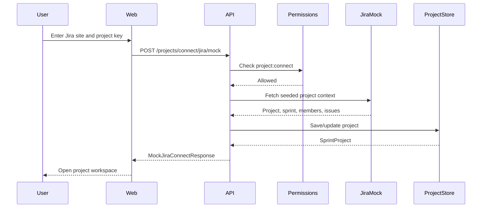

# SprintPulse AI Architecture Freeze

Phase: 2 - Solutions Architect
Status: frozen for UX and implementation planning
Date: May 11, 2026

## Architecture Goal

Move SprintPulse from a dashboard-first prototype into a believable role-aware SaaS POC:

```text
Public homepage
-> login
-> role-aware project list
-> add/connect project for elevated users
-> project workspace
-> standup input/sync
-> sprint dashboard
-> member pulse detail
```

The architecture must preserve the existing local-first stack and keep mocked integrations replaceable.

## Current Baseline

The current implementation already provides:

- React/Vite frontend.
- Express API.
- Shared TypeScript contracts.
- Demo login.
- Project setup screen.
- Dashboard.
- Member detail.
- Standup submission.
- Transcript parser mock.

Current route gap:

- `/` is currently protected dashboard, but product intent requires `/` to become a public homepage.
- `/setup` currently mixes manual setup and Jira fetch, but product intent separates project list, add project, and connect project.
- Dashboard/member/standup routes are not project-scoped yet.

## Recommended Target Routes

| Route | Component Intent | Access | Notes |
| --- | --- | --- | --- |
| `/` | Public homepage | Public | Product introduction and login CTA |
| `/login` | Login | Public | Demo email/password |
| `/projects` | Project list | Authenticated | Role-aware list and allowed actions |
| `/projects/new` | Add project | Elevated | Manual project, sprint, team details |
| `/projects/connect` | Connect project | Elevated | Mock Jira fetch first |
| `/projects/:projectId` | Project workspace home | Project member | Standup actions, sync status, sprint summary |
| `/projects/:projectId/standups` | Standup input | Project member | Manual, transcript, upload placeholder, sync placeholder |
| `/projects/:projectId/dashboard` | Dashboard | Role-aware project member | Existing dashboard moves here |
| `/projects/:projectId/members/:memberId` | Member detail | Role-aware project member | Existing member detail moves here |
| `/plan` | Hackathon plan | Authenticated | Optional/internal; can remain |

## Route Migration Plan

Use a low-risk route migration instead of a rewrite.

### Step 1 - Add New Routes

Add these new pages while keeping current pages working:

- `HomePage`
- `ProjectsPage`
- `AddProjectPage`
- `ConnectProjectPage`
- `ProjectWorkspacePage`

### Step 2 - Repoint Existing Screens

- Dashboard becomes `/projects/:projectId/dashboard`.
- Standup becomes `/projects/:projectId/standups`.
- Member detail becomes `/projects/:projectId/members/:memberId`.

### Step 3 - Temporary Redirects

Keep compatibility redirects for the current prototype:

- `/setup` -> `/projects/new` for elevated users, `/projects` for non-elevated users.
- `/standup` -> selected project standup route.
- `/members/:memberId` -> selected project member detail route.
- Protected `/` should no longer redirect to dashboard. It becomes public homepage.

## Role And Permission Model

Use permissions derived from `Persona.productPersona` and `Persona.accessScope`.

### Proposed Permission Flags

```ts
type Permission =
  | "project:view"
  | "project:create"
  | "project:connect"
  | "project:editTeam"
  | "standup:submit"
  | "standup:sync"
  | "dashboard:viewTeam"
  | "dashboard:viewOwn"
  | "member:viewTeam"
  | "member:viewOwn";
```

### Permission Mapping

| Persona | Permissions |
| --- | --- |
| Product Owner | view, create, connect, edit team, view team dashboard |
| Scrum Master | view, create, connect, edit team, submit/sync standups, view team/member dashboard |
| Engineering Manager / Architect | view, create, connect, edit team, view team/member dashboard |
| Individual Developer | view assigned projects, submit standup, view own/member-limited pulse |
| QA / Presentation | view assigned/demo projects, submit optional standup, view quality/demo dashboard |

## Shared Data Model

Add project-centric contracts to `packages/shared`.

```ts
type ProductPersona =
  | "product-owner"
  | "scrum-master"
  | "engineering-manager"
  | "architect"
  | "developer"
  | "qa"
  | "presenter";

type ProjectRole =
  | "product-owner"
  | "scrum-master"
  | "engineering-manager"
  | "architect"
  | "developer"
  | "qa";

type ProjectSource = "manual" | "jira-mock" | "jira";

interface ProjectMember {
  personaId: string;
  name: string;
  email: string;
  initials: string;
  role: ProjectRole;
  jiraAccountId?: string;
  githubUsername?: string;
}

interface SprintInfo {
  id: string;
  name: string;
  goal: string;
  startDate: string;
  endDate: string;
  status: "planned" | "active" | "closed";
}

interface SprintProject {
  id: string;
  key: string;
  name: string;
  source: ProjectSource;
  jiraSite?: string;
  sprint: SprintInfo;
  members: ProjectMember[];
  ownerIds: string[];
  scrumMasterIds: string[];
  createdBy: string;
  createdAt: string;
  updatedAt: string;
}

interface ProjectSummary {
  id: string;
  key: string;
  name: string;
  source: ProjectSource;
  sprintName: string;
  sprintGoal: string;
  memberCount: number;
  healthScore: number;
  atRiskCount: number;
  currentUserRole: ProjectRole;
  permissions: Permission[];
  lastSyncAt?: string;
}
```

## API Contracts

All routes remain under `/api`.

### Auth

| Method | Endpoint | Purpose |
| --- | --- | --- |
| `POST` | `/session` | Demo login by email/password |
| `GET` | `/me?personaId=` | Return viewer, permissions, and accessible project ids |

### Projects

| Method | Endpoint | Purpose |
| --- | --- | --- |
| `GET` | `/projects?personaId=` | Role-aware project list |
| `GET` | `/projects/:projectId?personaId=` | Project detail with viewer permissions |
| `POST` | `/projects` | Manual project create; elevated only |
| `POST` | `/projects/connect/jira/mock` | Mock Jira fetch and create/update project; elevated only |
| `PATCH` | `/projects/:projectId/team` | Add/edit people details; elevated only, optional for POC |

### Project Workspace

| Method | Endpoint | Purpose |
| --- | --- | --- |
| `GET` | `/projects/:projectId/workspace?personaId=` | Workspace summary, sync state, next action |
| `GET` | `/projects/:projectId/dashboard?personaId=` | Project-scoped dashboard |
| `GET` | `/projects/:projectId/members/:memberId?personaId=` | Project-scoped member detail |

### Standups

| Method | Endpoint | Purpose |
| --- | --- | --- |
| `GET` | `/projects/:projectId/standups?personaId=` | Standup history |
| `POST` | `/projects/:projectId/standups` | Manual standup create |
| `POST` | `/projects/:projectId/transcripts/parse` | Parse transcript mock |
| `POST` | `/projects/:projectId/standups/sync/mock` | Mock sync trigger |

### Compatibility Endpoints

Existing endpoints can remain during migration:

- `GET /dashboard`
- `GET /members/:memberId`
- `POST /standups`
- `POST /transcripts/parse`

They should delegate to the selected demo project once project-scoped APIs exist.

## API Response Shapes

### `GET /api/projects?personaId=...`

```ts
interface ProjectsResponse {
  viewer: Persona;
  projects: ProjectSummary[];
  canCreateProject: boolean;
  canConnectProject: boolean;
  recommendedProjectId?: string;
}
```

### `GET /api/projects/:projectId/workspace?personaId=...`

```ts
interface ProjectWorkspaceResponse {
  viewer: Persona;
  project: SprintProject;
  permissions: Permission[];
  sync: {
    mode: "manual" | "mock-auto" | "jira-mock";
    lastSyncAt?: string;
    nextSyncAt?: string;
    status: "idle" | "mocked" | "needs-setup" | "failed";
  };
  summary: {
    sprintDay: number;
    daysRemaining: number;
    participationRate: number;
    openBlockers: number;
    atRiskCount: number;
    healthScore: number;
  };
  nextActions: Array<{
    id: string;
    label: string;
    description: string;
    route: string;
    requiredPermission?: Permission;
  }>;
}
```

### `POST /api/projects/connect/jira/mock`

```ts
interface MockJiraConnectRequest {
  personaId: string;
  jiraSite: string;
  projectKey: string;
}

interface MockJiraConnectResponse {
  project: SprintProject;
  importedIssues: number;
  importedMembers: number;
  importedAt: string;
  warnings: string[];
}
```

## Data Ownership Boundaries

### Frontend Owns

- Route state.
- Current selected project id in local storage.
- Presentation of role-gated actions.
- Loading/error/empty states.

### Backend Owns

- Permission evaluation.
- Seed project/member/sprint data.
- Mock Jira import.
- Dashboard/member/standup aggregation.
- Compatibility endpoint delegation.

### Shared Package Owns

- Persona, project, sprint, team, permission, dashboard, standup, and integration response types.

## Integration Architecture

Use adapter boundaries even while mocked.

```text
Frontend
  -> Express API
    -> Project service
    -> Permission service
    -> Standup service
    -> Analysis service
    -> Integration adapters
       -> JiraAdapterMock now
       -> JiraAdapterReal later
       -> GitHubAdapterMock now/later
       -> LlmTranscriptAdapterMock now
       -> LlmTranscriptAdapterReal later
```

### Jira Adapter

Mock now:

- Accepts Jira site and project key.
- Returns seeded project, sprint, issues, and people.
- Includes warnings that the POC is using mock data.

Real later:

- Uses Jira Cloud REST API.
- Fetches project metadata, active sprint, issues, assignees, changelog.
- Requires user-provided token outside committed code.

### GitHub Adapter

Mock now/later:

- Member commit counts.
- PR count.
- Last commit time.
- Code churn level.

Real later:

- GitHub REST API by repo and author.
- Requires token outside committed code.

### LLM Adapter

Mock now:

- Deterministic transcript-to-speaker output.

Real later:

- OpenAI transcript parsing and recommendation generation.
- Must keep structured JSON schema.
- Must degrade to mock parser if key is absent.

## Architecture Diagram

```mermaid
flowchart LR
  "Public Home" --> "Login"
  "Login" --> "Project List"
  "Project List" --> "Project Workspace"
  "Project List" --> "Add Project"
  "Project List" --> "Connect Jira"
  "Connect Jira" --> "Mock Jira Adapter"
  "Add Project" --> "Project Service"
  "Project Workspace" --> "Standup Input"
  "Project Workspace" --> "Dashboard"
  "Standup Input" --> "Standup Service"
  "Standup Service" --> "Analysis Service"
  "Mock Jira Adapter" --> "Project Service"
  "Project Service" --> "Dashboard"
  "Dashboard" --> "Member Detail"
```

## Sequence: Mock Jira Connect



## Non-Functional Requirements

| Category | POC Requirement |
| --- | --- |
| Reliability | Golden demo path works without network integrations |
| Performance | Core pages render quickly from seeded API data |
| Security | No real secrets; role gating enforced in API and UI |
| Maintainability | Project-scoped APIs use shared contracts |
| Usability | UI clearly separates admin actions from member actions |
| Demo Safety | Manual setup fallback exists for Jira mock failure |

## Key Architecture Decisions

### Decision 1 - Keep Local-First Express API For POC

Rationale:

- Fastest path to a reliable demo.
- Team can run locally without AWS setup.
- API contracts can later move to Lambda or another backend.

Trade-off:

- Not production deployment architecture.
- Acceptable because the POC is about product proof.

### Decision 2 - Use Seeded Data And Mock Adapters

Rationale:

- Avoids dependency on Jira/GitHub/OpenAI credentials during demo.
- Makes the demo deterministic.
- Still allows clear replacement path.

Trade-off:

- Must be transparent in presentation that integrations are mocked.

### Decision 3 - Project-Scoped Routes And APIs

Rationale:

- Product flow needs multiple projects and role-specific access.
- Dashboard/member/standup data needs project context.

Trade-off:

- Requires route migration from current prototype.

### Decision 4 - API Enforces Permissions

Rationale:

- UI hiding alone is not credible.
- Even in POC, permission decisions should live in one backend helper.

Trade-off:

- Slightly more backend structure, but protects demo logic.

## Implementation Order

1. Extend shared contracts with project, sprint, permissions, and workspace types.
2. Add seeded projects and project membership to API seed data.
3. Add permission helpers.
4. Add `/api/projects` and `/api/projects/:projectId`.
5. Add mock Jira connect endpoint.
6. Add workspace endpoint.
7. Add project-scoped dashboard/member/standup endpoints.
8. Add frontend homepage and project routes.
9. Redirect/deprecate current `/setup`, `/standup`, `/members/:memberId` paths.

## Risks And Fallbacks

| Risk | Impact | Fallback |
| --- | --- | --- |
| Route migration breaks current dashboard | Demo flow interruption | Keep compatibility routes until new routes pass smoke test |
| Project model over-expands scope | Slower implementation | Only implement fields needed for UI and demo |
| Jira mock feels fake | Judge trust risk | Show clear import summary: issues, members, sprint, warnings |
| Role permissions confuse users | UX risk | Use simple labels: Admin actions, My actions, Team insights |
| Standup sync not real | Demo expectation risk | Present it as auto-sync preview and keep manual/paste reliable |

## Next Phase Input

UX phase should design:

- Public homepage.
- Project list.
- Add/connect project split.
- Project workspace home.
- Role-gated empty states and action states.

Implementation should not start until the UX phase confirms the screen hierarchy.

